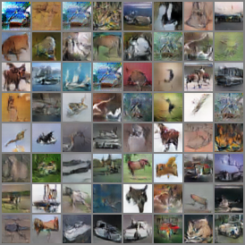
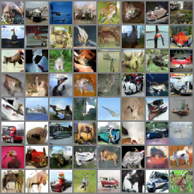
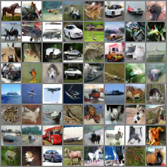
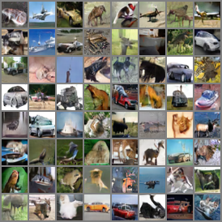
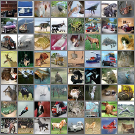
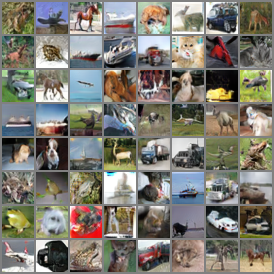

# Collections of GANs

Pytorch implementation of unsupervised GANs.

For more defails about calculating Inception Score and FID Score using pytorch can be found in [Pytorch-Unified-Inception-FID-Score](https://github.com/w86763777/Pytorch-Unified-Inception-FID-Score) 

## Models
- [x] DCGAN
- [x] WGAN
- [x] WGAN-GP
- [x] SN-GAN 

## Requirements
- python 3.6
- Install python packages
    ```bash
    pip install -U pip setuptools
    pip install -r requirements.txt
    ```

## Results

|Model          |Dataset|Inception Score|FID Score|
|---------------|-------|---------------|---------|
|DCGAN          |CIFAR10|6.111(0.088)   |41.75    |
|WGAN(CNN)      |CIFAR10|6.605(0.071)   |30.73    |
|WGAN-GP(CNN)   |CIFAR10|7.415(0.065)   |21.89    |
|WGAN-GP(ResNet)|CIFAR10|7.829(0.076)   |15.57    |
|SNGAN(CNN)     |CIFAR10|7.521(0.111)   |20.41    |
|SNGAN(ResNet)  |CIFAR10|8.214(0.094)   |14.41    |

## Examples
- DCGAN

     

- WGAN(CNN)

     

- WGAN-GP(CNN)

     

- WGAN-GP(ResNet)

     

- SNGAN(CNN)

     

- SNGAN(ResNet)

     

## Reproduce

### Training
- DCGAN
	```
    python gans/dcgan.py --flagfile ./config/DCGAN_CIFAR10.txt
    ```
- WGAN(CNN)
	```
    python gans/wgan.py --flagfile ./config/WGAN_CIFAR10_CNN.txt
    ```
- WGAN-GP(CNN)
	```
    python gans/wgangp.py --flagfile ./config/WGANGP_CIFAR10_CNN.txt
    ```
- WGAN-GP(ResNet)
	```
    python gans/wgangp.py --flagfile ./config/WGANGP_CIFAR10_RES.txt
    ```
- SNGAN(CNN)
	```
    python gans/sngan.py --flagfile ./config/SNGAN_CIFAR10_CNN.txt
    ```
- SNGAN(ResNet)
	```
    python gans/sngan.py --flagfile ./config/SNGAN_CIFAR10_RES.txt
    ```

### Generate GIF
```bash
python tools/sample2gif.py --logdir path/to/logdir
```
e.g.
```bash
python tools/sample2gif.py --logdir ./logs/DCGAN_CIFAR10
```
output GIF is `./logs/DCGAN_CIFAR10/progress.gif`